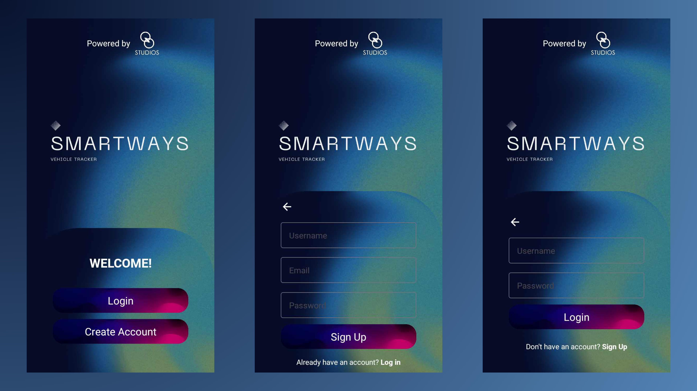
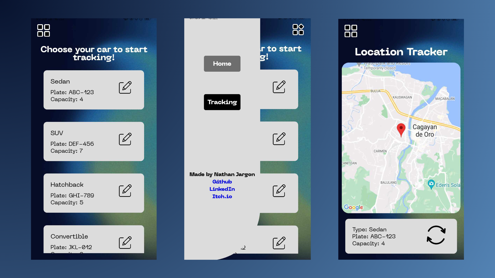

# Smartways 🚗🌐

Smartways is a real-time vehicle tracking Android application, utilizing the Global Positioning System (GPS) through the smartphone of the vehicle driver. An additional feature includes displaying the estimated time of arrival and specific information for each vehicle, such as plate number and seating capacity.

## Functionality 🛠️

- Real-time vehicle tracking: Utilizes the GPS in the driver's smartphone to provide real-time tracking of the vehicle.
- Vehicle information: Displays specific information for each vehicle, such as plate number and seating capacity.
- Estimated time of arrival: Provides an estimated time of arrival for each vehicle.

## Screenshots 📸

## License 📝

This project is not licensed for use. This means you cannot use, modify, or distribute the code or any part of the project without explicit permission from the owner.